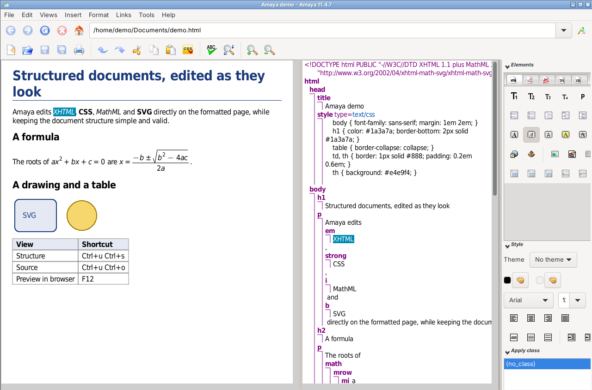

# Amaya, resurrected — the WYSIWYG web editor, on today's Linux

**amaya-modern** is a working port of [Amaya](https://www.w3.org/Amaya/)
11.4.7, the web editor and browser developed by W3C and Inria, to
current Linux (Ubuntu / Kubuntu 24.04, amd64): wxWidgets 3.2 on GTK 3,
GCC 13+, CMake, and libcurl in place of the long-gone libwww.

Amaya edits web pages *as they look*: you type, select and restyle text on
the formatted page, and Amaya keeps a clean, valid document structure
underneath (XHTML, CSS, MathML, SVG).  It is a good tool for writing simple,
structured pages, in contrast with the heavy pages most tools produce today.
Development stopped in 2012 (version 11.4.7), and the
[original repository](https://github.com/w3c/Amaya-Editor) was archived in
2018; this port makes it build and run well again.

> This is an independent, unofficial port.  It is not a W3C or Inria
> release and is not endorsed by them.  Most of its code was written by
> Claude, Anthropic's AI model (see [Credits](#credits-and-licence)).



---

## Contents

- [Status](#status)
- [Building](#building)
- [Running](#running)
- [Using Amaya](#using-amaya)
- [Known limitations](#known-limitations)
- [What changed from Amaya 11.4.7](#what-changed-from-amaya-1147)
- [Repository layout](#repository-layout)
- [Developer notes](#developer-notes)
- [Credits and licence](#credits-and-licence)

---

## Status

In regular use on a Kubuntu 24.04 desktop.

**Editing local files works well:**
- Formatted, structure, source, links and table-of-contents views, kept in step.
- XHTML 1.0 / 1.1 and HTML 4 documents, with CSS style sheets (Style panel,
  classes, style editor), MathML formulas, SVG drawings and tables.
- Keyboard input with accents and AltGr, copy/paste with other programs,
  undo/redo, spell checker, printing, preferences, multiple tabs and windows.

**Browsing and editing on the web works, within what a 2012 browser can do:**
- http and https pages, images and style sheets; forms (GET and POST); cookies.
- HTTPS certificate errors are explained, and you can trust a certificate yourself.
- Publishing to a web server with HTTP PUT is implemented, but little tested.
- There is no JavaScript, and modern CSS and HTML5 are understood only partly.
  **File > Preview in browser** (F12) shows the page in Firefox, for comparison.

**New in this port:**
- **File > Preview in browser** (F12).
- **File > Load cookies…**, to use in Amaya a login made in Firefox.
- **Ctrl+I**, **Ctrl+B** and **Ctrl+U** for italic, bold and underline,
  alongside Amaya's own two-key shortcuts.

See [Known limitations](#known-limitations) for what does not work.

---

## Building

### Prerequisites (Ubuntu / Kubuntu 24.04)

```bash
sudo apt install build-essential cmake git pkg-config \
  libwxgtk3.2-dev libgl-dev libglu1-mesa-dev \
  libfreetype-dev libfontconfig-dev libexpat1-dev \
  libcurl4-openssl-dev libssl-dev \
  zlib1g-dev libpng-dev libjpeg-dev
```

`libwxgtk3.2-dev` already includes the OpenGL canvas and pulls in GTK 3.
Other recent distributions with wxWidgets 3.2 should work, but have not been
tried.

### Compile

```bash
git clone https://github.com/jmcruzGH/amaya-modern.git
cd amaya-modern
mkdir build && cd build
cmake ..                 # RelWithDebInfo by default
make -j$(nproc)
```

This builds `build/amaya/amaya` and `build/amaya/print`, the helper that
**File > Print** runs.

**Keep the build directory directly inside the repository**, as `build/`
above, or `build-debug/`.  Amaya finds its data (`config/`, `resources/`,
`fonts/`, `doc/`, `dicopar/`, and the schemas in `amaya/`) two directories
above its binary.  Otherwise it stops at start-up with a
"No alphabet file" message.

To update later: `git pull`, then `make -j$(nproc)` in `build/`.

---

## Running

```bash
build/amaya/amaya                    # opens the welcome page
build/amaya/amaya ~/www/index.html   # opens a file (or an http/https address)
```

There is no installation step.  `make install` exists, but it installs
only the binaries and part of the data (the schemas, in `share/amaya`), so
the installed binary cannot start.  Run Amaya
from the build tree.

To start it from a menu or a terminal, use the binary's full path.
A symbolic link to it does not work, because Amaya looks for its data
next to the path it was started with.

- A script `~/bin/amaya`:

  ```sh
  #!/bin/sh
  exec "$HOME/amaya-modern/build/amaya/amaya" "$@"
  ```

- A desktop entry `~/.local/share/applications/amaya.desktop`.
  Replace `/home/me` with your home directory:

  ```ini
  [Desktop Entry]
  Type=Application
  Name=Amaya
  Comment=WYSIWYG web editor
  Exec=/home/me/amaya-modern/build/amaya/amaya %f
  Icon=/home/me/amaya-modern/resources/icons/misc/logo.png
  MimeType=text/html;application/xhtml+xml;
  Categories=Development;WebDevelopment;
  ```

---

## Using Amaya

**Help > Amaya Help…** (F1) opens Amaya's own user manual (from `doc/WX/`).  It is
still accurate for almost everything.  This section covers what is new or
different in this port.

### Your settings: `~/.amaya/`

Amaya keeps its per-user files in `~/.amaya/`, or in `$AMAYA_USER_HOME` if
that variable names an existing directory.

| File | Purpose |
|---|---|
| `thot.rc` | Preferences, written by **Edit > Preferences** and at exit. Settings without a dialog (below) go in its `[amaya]` section. Edit it while Amaya is closed. |
| `amaya.keyboard` | Optional personal keyboard shortcuts. It **replaces** `config/amaya.keyboard`, so start from a copy of that file. |
| `cookies.txt` | Persistent cookies (Netscape format, mode 0600), loaded at start-up and saved at exit. Session cookies are never written. |
| `trusted-certs.pem` | Certificates you trust in addition to the system's authorities (see [HTTPS certificates](#https-certificates)). |

Settings for `thot.rc`:

| Setting | Default | Purpose |
|---|---|---|
| `PREVIEW_BROWSER=` | `firefox` | Command for **Preview in browser**. It may have arguments, and `%u` marks where the file or address goes (otherwise it is appended), e.g. `firefox --new-window %u`. |
| `PREVIEW_DIR=` | see below | Folder for preview copies of remote pages (and of local files in folders Amaya cannot write to). |
| `SHORTCUT_DELAY=` | `1000` | Milliseconds (at least 100) before Ctrl+I/B/U act on their own; `0` waits for the next key. |
| `ENABLE_COOKIES=` | `yes` | `no` disables cookies. |
| `GL_PARTIAL_REDRAW=` | `no` | `yes` restores partial screen redraws. Not recommended: current drivers then leave stale pictures. |

### Keyboard shortcuts

The menus show each command's shortcut.  Amaya's own shortcuts are often
two-key sequences, with Ctrl held for both keys.  For example,
**Ctrl+I Ctrl+E** is emphasis (`<em>`), **Ctrl+I Ctrl+S** is strong
(`<strong>`), **Ctrl+U Ctrl+S** shows the structure view and
**Ctrl+U Ctrl+O** shows the source view.

The common one-key shortcuts work too:

| Keys | Element |
|---|---|
| **Ctrl+I** | italic `<i>` |
| **Ctrl+B** | bold `<b>` |
| **Ctrl+U** | underline `<u>` (new in **Insert > Character element**) |

These keys also start sequences, so their own action happens in one of two
ways:
- the next key does not continue a sequence (Ctrl+I, then typing, writes in
  italic);
- no key follows for one second (`SHORTCUT_DELAY`).

**Escape** cancels a pending shortcut.  Pressing the same keys again removes
the style.

In `amaya.keyboard`, a key may now both have its own action and start
sequences.  If you have a personal `~/.amaya/amaya.keyboard`, copy the
three `Ctrl <Key>i:` / `b:` / `u:` lines from `config/amaya.keyboard` into it.

### Preview in browser

**File > Preview in browser** (F12) shows the current document in an
external browser (Firefox by default), which runs JavaScript and modern CSS.
- A document without unsaved changes is shown as is, from its file or its
  http/https address.
- A document with unsaved changes, in the formatted or the source view, is
  first written to a preview copy.  The browser then shows what you are
  editing, without saving it.
  - For a local file, the copy is a hidden file next to it,
    `.<name>.amaya-preview.<ext>`, so relative links, images and style
    sheets work.  If that folder is not writable, the copy goes to the
    preview folder, with a `<base href>` pointing back to the file.
  - For a remote page, the copy goes to a preview folder and gets a
    `<base href>` that points back to the page's address.
- A local XHTML document that contains SVG or MathML is shown as a copy
  named `.xhtml`, unless its name already ends in `.xhtml`, `.xht` or `.xml`.  Amaya writes such documents with namespace prefixes
  (`<svg:svg>`), which only the browser's XML parser understands.  Browsers
  use that parser for local files only when the name ends in `.xhtml`.

Copies are removed when Amaya exits.  The default preview folder for remote
pages is `~/snap/<browser>/common/amaya-preview` when the browser is a snap,
as on Ubuntu, and `preview` in Amaya's temporary folder (normally
`~/.amaya/preview`) otherwise.  A snap browser cannot read
hidden folders such as `~/.amaya`, nor `/tmp`.

### HTTPS certificates

Amaya checks certificates against the system's authorities
(`/etc/ssl/certs`).  When it rejects one, the error page shows:
- why the certificate was rejected;
- the certificate's details and its SHA-256 fingerprint;
- when trusting it would help, the PEM text to append to
  `~/.amaya/trusted-certs.pem`.

The site's own certificate is enough.  To trust an authority in all programs
instead (Firefox excepted):
`sudo cp ca.crt /usr/local/share/ca-certificates/ && sudo update-ca-certificates`.

### Logging in to sites (cookies)

Amaya cannot ask for a password when a server requests one (HTTP 401), and
it runs no JavaScript, which many login pages need.  It does handle cookies,
so you can log in with Firefox and use that session in Amaya:

1. Log in to the site with Firefox.
2. Run `contrib/firefox-cookies.py site.example.org -o ~/site-cookies.txt`.
   It copies, from Firefox's default profile, the cookies that Firefox
   would send to that site (including those of its parent domain, e.g.
   `up.pt` for `sigarra.up.pt`).  The snap, classic and flatpak locations
   are searched; `--list-profiles` lists the profiles, and `--profile`
   picks another one.  Without `-o`, the cookies go to standard output.
3. In Amaya, choose **File > Load cookies…** and pick the file.  The status bar
   says how many cookies were loaded, and for which sites.  Amaya then offers
   to delete the file.

> **Security.** A cookie file holds your login: whoever has it can act as
> you on that site until the session ends.  The script makes it readable by
> you only, copies one site at a time, and sends nothing anywhere.  Delete
> the file after use.  Use this only on a computer you control.  Some sites
> tie a session to the browser it was made in, and refuse it elsewhere.

**Load cookies** accepts any Netscape-format file, such as those written by
curl and wget.

---

## Known limitations

- **Web content.** Amaya is a 2012 browser: HTML 4 / XHTML 1.x, CSS 2, no
  JavaScript.  Modern sites show partly, or ask for JavaScript.
- **Network:**
  - no HTTP authentication dialog; a 401 answer is shown as an error page;
  - the proxy settings in Preferences are ignored, but libcurl's `http_proxy`
    and `https_proxy` environment variables apply;
  - no ftp;
  - no HTTP cache;
  - no lost-update check when publishing.
- **Not compiled:** Annotations, WebDAV and bookmarks.  Templates, the spell
  checker, MathML, SVG and printing are compiled in.
- **Installation:** run from the build tree; `make install` is incomplete
  (see [Running](#running)).
- **Platforms:** Linux only.  The Windows and macOS build files are the
  original ones and are not maintained.
- **Harmless console messages:**
  - `GL_Err: invalid operation`, mostly while scrolling;
  - `GLib-CRITICAL … g_signal_handler_disconnect` when a tab closes, which
    comes from the fcitx5 input method;
  - libpng warnings about some images.

---

## What changed from Amaya 11.4.7

The W3C licence asks derived works to state their changes and when they were
made.  The port was made between September and October 2026, starting from
the final W3C sources (the root commit of `main`).  The full detail, one
change per commit, is in `git log`.  In summary:

**Toolkit and compiler (September 2026)**
- wxWidgets 2.8 → 3.2 on GTK 3.  Event names and constructors were updated;
  `compat/wx3compat.h`, included in every file, maps the remaining old names.
- Fixed at run time under wx 3.2: OpenGL context sharing, glyph positions
  and baselines, and keyboard input (corrupted characters, arrow keys, AltGr).
- New CMake build that replaces autoconf.

**Code health (October 2026)**
- Amaya is built with `-Wall`, with no suppressed warnings and no
  `-fpermissive` (the schema compilers in `batch/` are still built leniently).
- Hundreds of warnings fixed, among them real bugs: buffer overflows, format
  strings, NULL dereferences from operator precedence, uninitialised
  variables, and integers stored in pointers.
- Crashes fixed, most found with AddressSanitizer:
  - long attribute values;
  - long or malformed CSS selectors;
  - the class list on some sites;
  - the OpenGL matrix stack overflowing on pages with complex SVG;
  - heap corruption at exit (introduced by the network port).
- Text editing no longer corrupts text (overlapping string copies).

**Display**
- Always redraw the whole frame, with no stale or misplaced pictures after
  edits, scrolling, pasting or clicks.
- Smooth, high-resolution and horizontal mouse wheels.
- Scrollbars stay in place, disabled when not needed.
- The page width is updated for images that arrive late.

**Network (September–October 2026)**
- libwww, no longer maintained or packaged, replaced by libcurl
  (`amaya/query.c`, September), then completed (October):
  - asynchronous loading and stop;
  - redirects, form GET/POST and HTTP PUT;
  - https;
  - cookies;
  - error pages, and pages that explain rejected certificates.
- HTML5 `<meta charset>` is recognised; site icons may be SVG.

**Interface**
- Restored: the Style panel, Enter in text fields, closing the last tab,
  and Tab / Shift+Tab between form fields.
- The `print` helper is built again.
- Saving and the source view of XHTML 1.1 documents work: the missing
  `HTMLT11.TRA` was generated.
- New: Preview in browser; Load cookies; Ctrl+I/B/U and Insert > Character
  element > Underline.
- No developer trace window in normal builds.

---

## Repository layout

| Path | Contents |
|---|---|
| `amaya/` | The application: HTML/XML parsers, CSS, editing commands, network layer (`query.c`), dialogs (`wxdialog/`).  Also the structure, presentation and translation schemas (`*.S`, `*.P`, `*.T` sources; compiled `*.STR`, `*.PRS`, `*.TRA`) |
| `amaya/generated/` | Code generated from the application schemas (`*.A`), committed |
| `thotlib/` | The Thot document engine: document model, layout, OpenGL display, wx windows |
| `batch/` | Schema compilers (built on demand, see below) |
| `config/` | Run-time configuration: `unix-thot.rc`, keyboard files, menu texts in 17 languages (`*-amayadialogue`), profiles |
| `resources/` | Icons, wx dialog layouts (`xrc/`), SVG resources |
| `fonts/`, `dicopar/`, `doc/WX/` | Fonts, spell-checking dictionaries, user manual, all read at run time |
| `compat/` | `wx3compat.h`, the wx 2.8 → 3.2 compatibility header |
| `cmake/` | `config.h.in` for CMake |
| `contrib/` | `firefox-cookies.py` |
| `tools/` | Tests and maintenance scripts (see [Developer notes](#developer-notes)) |
| `docs/` | `TESTING.md` (desktop test checklist), the screenshot and its document (`demo.html`) |
| `annotlib/`, `davlib/` | Annotations and WebDAV: original code, not compiled |
| `LICENSE` | The W3C licence (same text as `amaya/COPYRIGHT`) |

The following are kept as they were in W3C's tree but are **not used** by
this build:
- the autoconf build: `configure*`, the `Makefile.in` files, `Options.in`,
  `config.*`, `install-sh`, `stamp-h.in`, `tools/cextract-1.7`,
  `tools/mkdep`;
- packaging: `*.nsi`, `amaya_wx.spec`, `amaya.info`, `amaya.pkg`,
  `WindowsWX/`, `cpp/`, the install scripts in `batch/`;
- `CVSROOT/`, `README.amaya`, `README.wx`, `README.cvs`,
  `AmayaWX_Compilation.html`, `Icons/`, `tools/xmldialogues/`, and the rest
  of `doc/`.

`amaya/*.libwww` are the original libwww-based network files, kept for
reference.  The `testcase` file is used only by the Debug build's trace
window.

---

## Developer notes

### Debug and AddressSanitizer builds

```bash
mkdir build-debug && cd build-debug
cmake .. -DCMAKE_BUILD_TYPE=Debug && make -j$(nproc)
```

```bash
mkdir build-asan && cd build-asan
cmake .. -DCMAKE_BUILD_TYPE=RelWithDebInfo \
  -DCMAKE_C_FLAGS="-fsanitize=address -fno-omit-frame-pointer" \
  -DCMAKE_CXX_FLAGS="-fsanitize=address -fno-omit-frame-pointer" \
  -DCMAKE_EXE_LINKER_FLAGS="-fsanitize=address"
make -j$(nproc)
ASAN_OPTIONS=detect_leaks=0:halt_on_error=1:log_path=/tmp/amaya-asan ./amaya/amaya
```

A Debug build also opens a developer trace window beside each Amaya window.
In normal builds, Amaya's crash handler saves the open documents and then
lets the crash through, so core dumps work; ASan builds do not install it,
so AddressSanitizer reports the crash itself.  `AMAYA_TRACE_GL=1` traces
the OpenGL matrix stack.

### Tests

- `tools/smoke-test.sh [build-dir]`, run from the repository root.  It runs a
  short editing session under a virtual X server and checks the saved file.
  It needs `xvfb xdotool x11-apps imagemagick`.
- `tools/edit-stress-test.py [build-dir] [seed]`.  It makes random
  keyboard edits and compares the result with the expected text; set `NOPS`
  for the number of edits.  It needs `xvfb xdotool openbox`.  It kills any
  running Xvfb, openbox and amaya.
- [`docs/TESTING.md`](docs/TESTING.md) is a checklist for a real desktop.

### Schemas and generated files

The compiled schemas (`amaya/*.STR`, `*.PRS`, `*.TRA`) and
`amaya/generated/` are committed, so a normal build does not need the
schema compilers.

- **Translation schemas** (`*.T`, used to save documents and for the source
  view): `amaya_tra_compiler` builds and works:

  ```bash
  cd build && make amaya_tra_compiler
  cd ../amaya   # HTMLT.T includes greek.sgml from here
  ../build/batch_tools/amaya_tra_compiler HTMLT                          # HTMLT.TRA
  ../build/batch_tools/amaya_tra_compiler -DXML HTMLT HTMLTX             # XHTML 1.0
  ../build/batch_tools/amaya_tra_compiler -DXML -DXHTML11 HTMLT HTMLT11  # XHTML 1.1
  ```

  It also writes an `HTMLT.SCH` work file, which can be deleted.  (The
  `amaya_schemas` target is left over from an earlier attempt: do not use it.)
- **Structure and application schemas** (`*.S`; `*.A`, menus and their
  actions): their compilers (`amaya_str_compiler`, `amaya_app_compiler`) do
  not build yet, because they include the wx headers as C.  There is no
  target for the presentation compiler (`*.P`).  A change to an `.A` file
  must therefore also be made by hand in `amaya/generated/` and in the menu
  texts.  For a new entry in `EDITOR.A`,
  `tools/add-editor-menu-item.py` does all of it:

  ```bash
  tools/add-editor-menu-item.py BPrint BMyEntry MyAction 'My &entry...' 'pt=A minha &entrada...'
  ```

  It adds the entry after an existing button or toggle (here `BPrint`).  It
  updates:
  - `EDITOR.A`;
  - the generated `EDITOR.h` and `EDITORAPP.c`: labels are numbered in menu
    order, so later ones shift by one, and the item and action counts grow;
  - the label in every `config/*-amayadialogue` file, in English unless a
    translation is given;
  - `config/amaya.profiles`, without which the entry stays hidden.

  You then write `void MyAction (Document, View)` in a source file.

### Architecture

```
amaya/            application: parsers, CSS, editing commands, network (query.c)
  wxdialog/       wx dialogs (Open, Save, Find, Preferences…)
thotlib/
  document/       document model, schemas, pivot format
  tree/           element tree, attributes, references
  editing/        selection, undo, structural commands, scrolling
  content/        text buffers, search
  view/           box layout and OpenGL display
  presentation/   presentation rules and CSS application
  dialogue/       wx windows, frames, panels, canvas, keyboard input
  base/           memory, settings registry, messages
  image/          PNG, JPEG, GIF, XPM pictures
batch/            schema compilers (.S → .STR, .P → .PRS, .T → .TRA, .A → C)
```

Display goes from layout (`thotlib/view/buildboxes.c`) to OpenGL drawing
(`thotlib/view/glwindowdisplay.c`, `frame.c`) on an `AmayaCanvas`
(a `wxGLCanvas`) in the wx event loop.  Each view is a frame number
indexing `FrameTable[]`.  The network layer polls libcurl from a wx timer
every 50 ms.

### Open points

- **C compiled as C++.** Every `.c` file is compiled as C++, because the wx
  headers it includes declare C++ classes.  This is stable; going back to C
  would mean guarding those headers.
- **Warnings.** A clean build has about 580 distinct warnings, mostly
  `-Wunused-but-set-variable` and `-Wswitch-outside-range` (noise).  A few
  format warnings remain in the print helper.  There are no errors.
- **`thotlib/editing/structcreation.c` (around line 3838)** compares two
  arrays, which is always false, also in 11.4.7.  It is left as is, because
  changing it would change editing behaviour.
- **Possible future work:**
  - an HTTP authentication dialog;
  - proxy settings;
  - an install target;
  - better HTML5 support;
  - a Qt port of `thotlib/dialogue/`.

---

## Credits and licence

Amaya was created at **Inria** and **W3C** by Irène Vatton, Vincent Quint,
Laurent Carcone, José Kahan and many contributors, 1996–2012.
This port: © 2026 JoseMCruz `<jmcruz@fe.up.pt>`, FEUP, University
of Porto.

**How this port was made.** Most of the port's code was written by
[Claude](https://www.anthropic.com/claude), Anthropic's AI model, working
as the main developer in Claude Code sessions: diagnosing the problems,
writing the fixes and new features, testing them under a virtual X server
and with AddressSanitizer, and writing this documentation.  JoseMCruz led the project.  He chose what to fix and in what order, tested every
change on his own desktop, reported the bugs he found in daily use, and
reviewed and published the result.  Commits written by Claude carry a
`Co-Authored-By: Claude` line.

Amaya is distributed under the
[W3C Software Notice and License](https://www.w3.org/Consortium/Legal/2002/copyright-software-20021231)
(full text in [`LICENSE`](LICENSE)), and so are the changes made in this port.
The fonts in `fonts/` are those distributed with Amaya 11.4.7 (DejaVu, GNU
FreeFont, ESSTIX, Bitstream Cyberbit, and Amaya's own symbol fonts), each
under its own licence; the licence texts are not included.  Bitstream
Cyberbit's terms are restrictive: check them before redistributing it.
